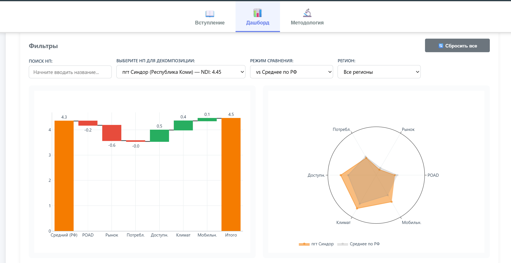
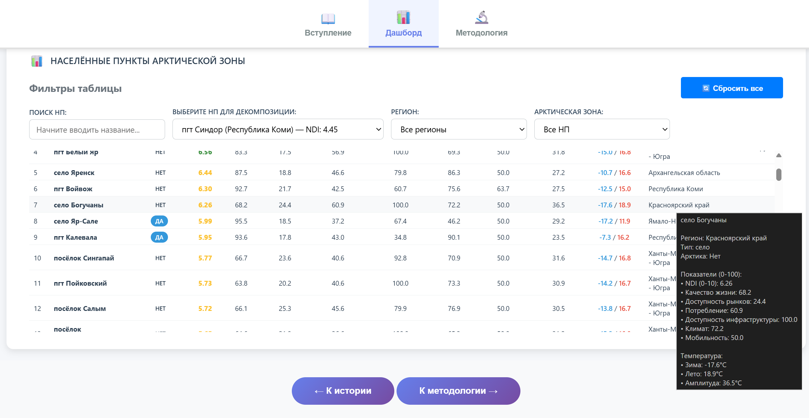

# 🏔️ Arctic Dashboard - Northern Development Index

Интерактивный дашборд для оценки развития 128 арктических населённых пунктов России на основе индекса NDI (Northern Development Index).

[Ссылка для знакомства с дашбордом (6 минут)](https://drive.google.com/file/d/1V10jB4SxiDTFYGmxjNtIKSx9jdoNNoTE/view?usp=sharing)  
_(лучше увеличивать скорость воспроизведения)_


## 🚀 Быстрый старт

### Вариант А: Просмотр dashboard (без установки)

1. Откройте дашборд в браузере:  
   https://daryapodakova.github.io/sberindex_dashboard/dashboard/dashboard.html
2. Все данные уже встроены; интернет нужен только для загрузки Plotly CDN.



**Готово!** Dashboard работает локально.

### Вариант Б: Полное воспроизведение с генерацией данных

См. подробные инструкции в [docs/QUICKSTART.md](docs/QUICKSTART.md)

## 📊 Что внутри?

- **128 населённых пунктов** северных регионов России
- **6 компонентов NDI**:
  - POAD (Привлекательность) - 35%
  - Market Access (Доступность рынков) - 20%
  - Consumption (Потребление) - 15%
  - Accessibility (Доступность инфраструктуры) - 15%
  - Climate (Климат) - 10%
  - Mobility (Мобильность) - 5%
- **9 кластеров** населённых пунктов по уровню развития
- **Интерактивные фильтры**: регион, арктическая зона, категория NDI
- **Визуализации**: treemap карта, таблица ТОП-15 критических НП, KPI карточки

## 🎯 Основные возможности

- 📈 **Treemap карта** с drill-down по регионам и населённым пунктам
- 🚨 **ТОП-15 критических НП** (NDI < 3.0) с интерактивной таблицей
- 🎨 **Цветовая кодировка** по уровню развития (Критический/Низкий/Средний/Высокий)
- 🔍 **Фильтры** по региону, арктической зоне и категории NDI
- 📱 **Адаптивный дизайн** для различных устройств

## 🗂️ Структура проекта

```
sberindex_dashboard/
├── dashboard/          # Готовый HTML дашборд
│   ├── dashboard.html  # Главный файл (автономный, 116 KB)
│   └── ndi_data.json   # Данные NDI (опционально, для справки)
├── scripts/            # Pipeline обработки данных (10 скриптов)
│   ├── 01_load_data.py
│   ├── 02_correlation_analysis.py
│   ├── 03_attractiveness_v1.py
│   ├── 04_clustering.py
│   ├── 05_visualize_map.py
│   ├── 06_distances.py
│   ├── 07_accessibility.py
│   ├── 08_attractiveness_v2.py
│   ├── 09_build_dashboard.py
│   └── 10_build_dashboard_filtered.py
├── sql/                # Миграции PostgreSQL
│   ├── 001_create_schema.sql
│   ├── 002_create_dictionaries.sql
│   ├── 003_create_fact_tables.sql
│   ├── 004_create_sberindex_data.sql
│   └── 005_create_mobility_index.sql
├── db_tools/           # Утилиты для работы с БД
│   └── connection_pool_legacy.py
├── docs/               # Документация
│   ├── QUICKSTART.md
│   ├── README_ETL.md
│   ├── SUMMARY.md
│   ├── TABLE_RELATIONSHIPS.md
│   ├── PARQUET_LOAD_SUMMARY.md
│   └── NDI_VIEW_README.md
├── data/               # Placeholder для исходных данных
│   └── README.md
├── requirements.txt    # Python зависимости
├── .env.example        # Шаблон переменных окружения
├── .gitignore          # Исключения для Git
└── README.md           # Этот файл
```

## 🛠️ Технологический стек

- **Python**: pandas, numpy, scikit-learn, plotly
- **Database**: PostgreSQL 15+ (только для воспроизведения данных)
- **Frontend**: Plotly.js v3.1.1, vanilla JavaScript
- **Data Sources**: СберИндекс (POAD), Open-Meteo (климат), Росстат (мобильность)

## 📚 Документация

- [QUICKSTART.md](docs/QUICKSTART.md) - Быстрый старт и инструкции по развертыванию
- [README_ETL.md](docs/README_ETL.md) - Полная техническая документация ETL процесса
- [NDI_VIEW_README.md](docs/NDI_VIEW_README.md) - Описание индекса NDI и компонентов
- [TABLE_RELATIONSHIPS.md](docs/TABLE_RELATIONSHIPS.md) - Схема базы данных
- [SUMMARY.md](docs/SUMMARY.md) - Общее резюме проекта

## 🔧 Требования

### Для просмотра dashboard (Вариант А):
- Современный браузер (Chrome, Firefox, Safari, Edge)
- Интернет (только для загрузки Plotly CDN)

### Для воспроизведения данных (Вариант Б):
- Python 3.8-3.12
- PostgreSQL 15+
- Исходные данные (см. [data/README.md](data/README.md))

## 🚀 Установка и запуск

### Просмотр dashboard

```bash
# 1. Клонировать репозиторий
git clone https://github.com/your-org/sberindex_dashboard.git
cd sberindex_dashboard

# 2. Открыть dashboard
cd dashboard
open dashboard.html  # macOS
start dashboard.html # Windows
xdg-open dashboard.html # Linux
```

### Полное воспроизведение

```bash
# 1. Клонировать репозиторий
git clone https://github.com/your-org/sberindex_dashboard.git
cd sberindex_dashboard

# 2. Установить зависимости
pip install -r requirements.txt

# 3. Настроить переменные окружения
cp .env.example .env
# Отредактировать .env файл с параметрами БД

# 4. Применить миграции БД
cd sql
psql -U postgres -d platform -f 001_create_schema.sql
psql -U postgres -d platform -f 002_create_dictionaries.sql
psql -U postgres -d platform -f 003_create_fact_tables.sql
psql -U postgres -d platform -f 004_create_sberindex_data.sql
psql -U postgres -d platform -f 005_create_mobility_index.sql

# 5. Загрузить исходные данные
# См. инструкции в docs/QUICKSTART.md

# 6. Запустить pipeline
cd ../scripts
python 01_load_data.py
python 02_correlation_analysis.py
python 03_attractiveness_v1.py
python 04_clustering.py
python 05_visualize_map.py
python 06_distances.py
python 07_accessibility.py
python 08_attractiveness_v2.py

# 7. Сгенерировать dashboard
python 09_build_dashboard.py
# ИЛИ улучшенная версия с фильтрами:
python 10_build_dashboard_filtered.py
```

## 📊 Структура данных

Dashboard использует JSON данные со следующей структурой:

```json
{
  "settlement_id": 43,
  "settlement_name": "пгт Надвоицы",
  "settlement_type": "пгт",
  "region_name": "Республика Карелия",
  "poad_score": 0.6532,
  "market_score": 1.0,
  "consumption_score": 0.6579,
  "accessibility_score": 0.4564,
  "climate_score": 0.8872,
  "mobility_score": 0.5,
  "ndi_score": 0.7095,
  "ndi_10": 7.09,
  "ndi_rank": 1,
  "avg_hdd_yearly": 5350.33
}
```

**128 населённых пунктов** с полным набором метрик NDI.

## 🤝 Вклад в проект

Мы приветствуем вклад в развитие проекта!

1. Fork репозитория
2. Создайте feature branch (`git checkout -b feature/AmazingFeature`)
3. Commit изменения (`git commit -m 'Add some AmazingFeature'`)
4. Push в branch (`git push origin feature/AmazingFeature`)
5. Откройте Pull Request

## 📄 Лицензия

- **Код проекта**: MIT License
- **Данные СберИндекс**: CC BY-SA 4.0
- **Климатические данные**: Open-Meteo (CC BY 4.0)

## 👥 Авторы

Проект разработан в рамках хакатона Сбербанк 2025 (Arctic Challenge).

## 📞 Контакты

Если у вас есть вопросы или предложения, пожалуйста:
- Откройте [Issue](https://github.com/your-org/sberindex_dashboard/issues)
- Напишите в [Discussions](https://github.com/your-org/sberindex_dashboard/discussions)

## 🙏 Благодарности

- **СберИндекс** за предоставление данных POAD
- **Open-Meteo** за климатические данные
- **Росстат** за данные по мобильности населения
- **Plotly** за отличную библиотеку визуализации

---

**Сделано с ❤️ для развития Арктики России**
